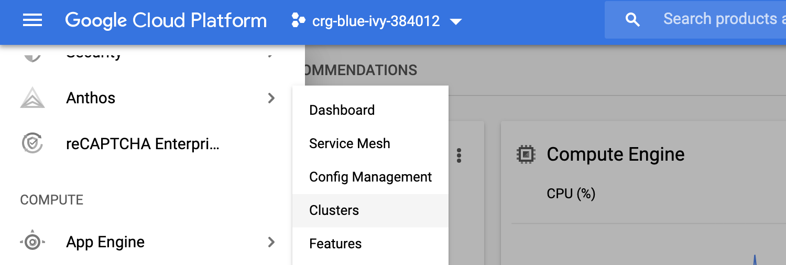
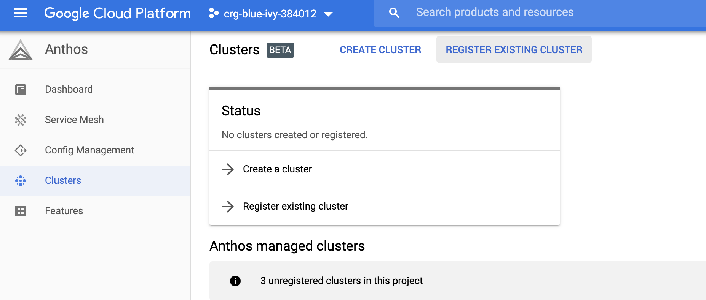

# Environments & Clusters
 
Organizations are often challenged with the need to run workloads in different locations for a variety of reasons. Additionally administrators are tasked with enabling multiple teams with low friction platforms that allow teams to deploy rapidly throughout multiple life cycles.   Anthos incorporates multiple clusters across locations under one comprehensive platform, providing the ability to operate clusters across providers and datacenters, while reducing operational overhead. 

### Objectives
In this lab you’ll work with some of the fundamental concepts in Anthos related to creating clusters and grouping them into Environs within your projects.  

You’ll learn about:

- Provisioning Platform Resources
- Cluster Organization Best Practices
- Registering Clusters through Hub & Environs


## Before you begin
To get started with this lab you’ll need to install tooling, set a few variables and provision the environment. Follow the steps below to prepare your lab.

### Task: Install Tools

This lab utilizes terraform to provision the base clusters and Anthos components. Additionally this lab implements GitOps patterns backed by a git repository. In this example you’ll integrate Anthos with GitHub repositories. To facilitate creation of the repositories the lab makes use of the GitHub command line tool. 

Install the following tools with the instructions provided in the links below. 

- [Terraform](https://learn.hashicorp.com/terraform/getting-started/install.html)
- [GitHub's cli gh](https://github.com/cli/cli)

### Task: Clone Lab Repository

Clone the repository onto your local computer and change into the directory.

```shell
git clone sso://user/crgrant/anthos-workshop -b v2
cd anthos-workshop
```

### Task: Set Lab Variables

Set global variables that are used throughout the workshop

```shell
gcloud config set core/project YOUR_PROJECT
export GITHUB_USERNAME=YOUR_USERNAME #UPDATE WITH YOUR ID
```
 
### Task: Prepare the workspace

In this task you’ll prepare your workspace for use in this lab. The commands below will set some additional global variables used throughout the examples. It will also create a GitHub repository from assets stored in the resources directory. 

```shell
gcloud components update --quiet
source $BASE_DIR/labs/env
source $BASE_DIR/labs/platform/clusters/prep.sh
```


## Provisioning Resources

One of the fundamental challenges for platform teams is ensuring a way to consistently build and update core infrastructure resources across providers and onprem. Many of these organizations have adopted Terraform to help facilitate this automation.  In this example you’ll extend a set of existing resources to include an additional cluster with Anthos components enabled. 

### Task: Create an Anthos Cluster
 
Google works closely with Terraform to provide modules and resources for Google Cloud Platform services. In the following example you’ll utilize the Terraform module for GKE and Anthos Config Manager (ACM).

Add the lines from both of the tabs listed in the box below to the appropriate files located in `$BASE_DIR/workdir/tf`


=== "cluster.tf"
    ```terraform

    # Provision a Secondary Production Cluster
    resource "google_container_cluster" "prod-secondary" {
        name               = "${var.gke_name}-prod-secondary"
        location           = var.secondary_zone
        initial_node_count = 4
        depends_on = [google_project_service.container]
    }

    # Retrieve Cluster Credentials
    resource "null_resource" "configure_kubectl_prod-secondary" {
        provisioner "local-exec" {
            command = "gcloud container clusters get-credentials ${google_container_cluster.prod-secondary.name} --zone ${google_container_cluster.prod-secondary.location} --project ${data.google_client_config.current.project}"
        }
        depends_on = [google_container_cluster.prod-secondary]
    }

    ```

=== "acm.tf"
    ```terraform

    # Enable Anthos Configuration Management
    module "acm-prod-secondary" {
        source           = "terraform-google-modules/kubernetes-engine/google//modules/acm"
        skip_gcloud_download = true

        project_id       = data.google_client_config.current.project
        cluster_name     = google_container_cluster.prod-secondary.name
        location         = google_container_cluster.prod-secondary.location
        cluster_endpoint = google_container_cluster.prod-secondary.endpoint

        operator_path    = var.acm_operator_path
        sync_repo        = var.acm_repo_location
        sync_branch      = "master"
        policy_dir       = "."
    }

    ```


### Task: Provision Resources

With the new additions to the Terraform scripts you’re ready to spin up the environment. Execute the commands below. 

```shell
cd $WORK_DIR/tf 
./tf-up.sh
```

This setup process will:

- Create 3 clusters: prod-primary, prod-secondary, and stage
- Pull the contexts locally for each cluster so you can interact via kubectl
- Install ACM on the 2 prod clusters. You’ll install ACM on stage in the next lab

This step will take ~5 minutes. 

## Working with Environs

A Google Cloud Platform (GCP) project can contain some resources that are enabled for Anthos and some that are not. For example you may have a series of GKE clusters utilizing Anthos features and while a separate sandbox cluster may have been spun up temporarily for testing purposes. To enable Anthos features on a Kubernetes cluster, whether on GCP or other location, you’ll need to register the cluster in an Anthos Environ, a unified organizational element across GCP, your Data Centers and other Cloud Providers.  

### Task: Register With Anthos Hub
To add a cluster to an Anthos Environ the following steps need to be performed:

- Create a service account (SA) to connect the agent with Google
- Register the Cluster & SA with Anthos Environ

The service account is used by your cluster to communicate with Anthos in GCP. The registration process will create a membership for your cluster within GCP and initializes the Connect Agent on your cluster. 

Follow either the Console OR gcloud method below to register your cluster.


=== "Console"
    
    Click on Anthos -> Clusters from the left navigation

    

    Click on `Register Existing Cluster` from the top navbar

    

    Now click the `Register` button next to the `boa-prod-secondary` cluster

    
    
    Deselect the `Download new service key` option and click `Submit`

    

    Once all the steps have completed click `Done`


=== "gcloud"
    Create a service account
    ```shell
    export GKE_CONNECT_SA=gke-connect-sa
    export GKE_CONNECT_SA_FILE=$WORK_DIR/$GKE_CONNECT_SA-creds.json
    gcloud iam service-accounts create $GKE_CONNECT_SA --project=$PROJECT
    ```

    Create & download a key
    ```shell
    gcloud iam service-accounts keys create $GKE_CONNECT_SA_FILE \
    --project=$PROJECT \
    --iam-account=$GKE_CONNECT_SA@$PROJECT.iam.gserviceaccount.com 
    ```

    Register with hub

    ```shell
   
    GKE_CLUSTER=us-west1-b/boa-prod-secondary

    gcloud container hub memberships register boa-prod-secondary \
    --project=$PROJECT \
    --gke-cluster=$GKE_CLUSTER \
    --service-account-key-file=$GKE_CONNECT_SA_FILE

    ```

    Confirm Registration by running

    
    ```shell
    gcloud container hub memberships list
    ```
    
    Output
    
    <pre>
    NAME                EXTERNAL_ID
    boa-prod-secondary  e0f007ef-a9e6-11ea-88fb-42010a8a0002
    </pre>


### Cleanup Lab

If you're continuing on with the next lesson, skip this step, you'll use the resources in the next lab.

However if you'd like to teardown your environment simply run

```shell
cd $WORK_DIR/tf 
./tf-down.sh
```

## Resources

- [Anthos Technical Overview](https://cloud.google.com/anthos/docs/concepts/overview)
- [Anthos Environs](https://cloud.google.com/anthos/multicluster-management/environs)
- [Terraform GKE ACM Submodule](https://registry.terraform.io/modules/terraform-google-modules/kubernetes-engine/google/8.1.0/submodules/acm)
- [Terraform GKE ASM Submodule](https://github.com/terraform-google-modules/terraform-google-kubernetes-engine/tree/add-asm-module/modules/asm)
- [Register a cluster](https://cloud.google.com/anthos/multicluster-management/connect/registering-a-cluster)

